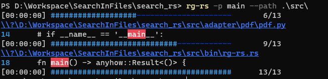

# SearchInFiles

Search content in files

## Feature

- Custom editable file
- pdf
- xlsx, xls
- docx, doc

## Roadmap

- **pdf lib alternatives** I do not find a suitable lib to extract pdf files in string like other languages, so i have to use python,
  therefore, i try to find more suitable lib to replace python dependencies
- **pdf extract precise** Current using Python and only extract word file exclude table and pic.

- **multi-thread** Rust is good, but for this tool, it currently uses single thread to handle all file

- **GUI** trying to use `tauri` to do the GUI.

- **ZIP** Current not support for zip file.

- For MS office file, some xlsx are not MS can not support

- Refactor code

## Usage

```shell
PS D:\Workspace\SearchInFiles\search_rs> rg-rs -p main --path .\src\
[00:00:00] ###################---------------------       6/13
# \\?\D:\Workspace\SearchInFiles\search_rs\src\adapter\pdf\pdf.py
14      # if __name__ == '__main__':
[00:00:00] ############################------------       9/13
# \\?\D:\Workspace\SearchInFiles\search_rs\src\bin\rg-rs.rs
18      fn main() -> anyhow::Result<()> {
[00:00:00] ########################################      13/13
```


